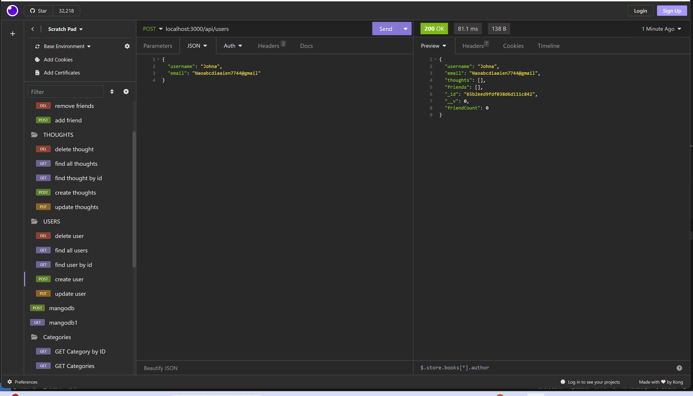
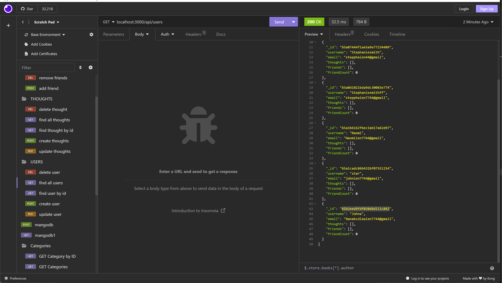
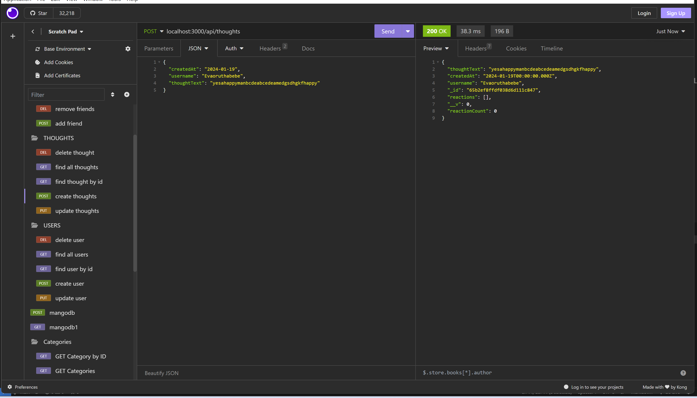
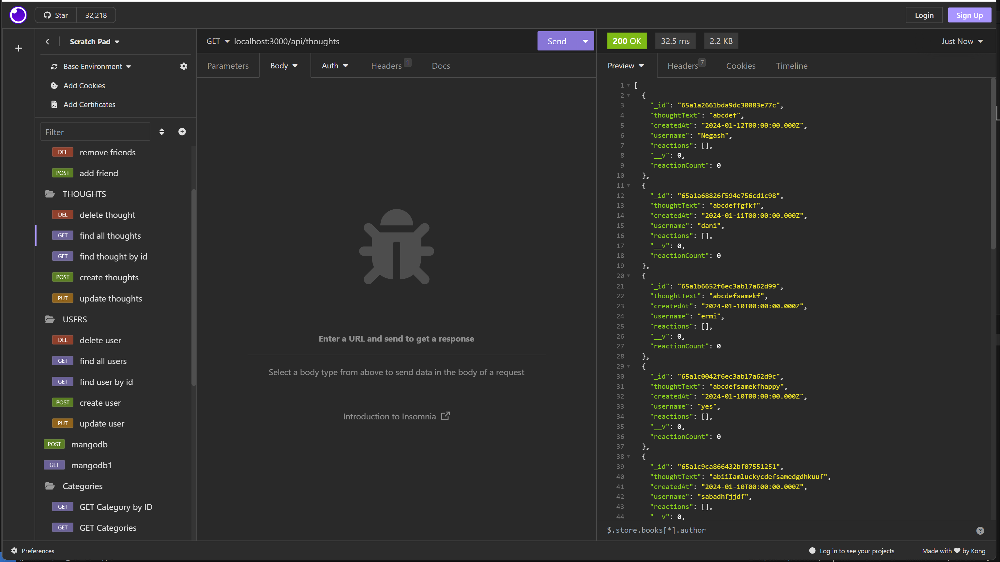

Introduction:
This is the code implemented as module 18 challenge fullfillment at bootscamp fusllstack course.
It use express.js, and other technologies to implement this api. Anyone who need to modify this api can do so.

GIVEN a social network API
WHEN I enter the command to invoke the application
THEN my server is started and the Mongoose models are synced to the MongoDB database
WHEN I open API GET routes in Insomnia for users and thoughts
THEN the data for each of these routes is displayed in a formatted JSON
WHEN I test API POST, PUT, and DELETE routes in Insomnia
THEN I am able to successfully create, update, and delete users and thoughts in my database
WHEN I test API POST and DELETE routes in Insomnia
THEN I am able to successfully create and delete reactions to thoughts and add and remove friends to a user’s friend list

screenshots

The video demo link
https://drive.google.com/file/d/1tY_kJCmaLIuFyi7qdA38BZ07fVS4XW_C/view